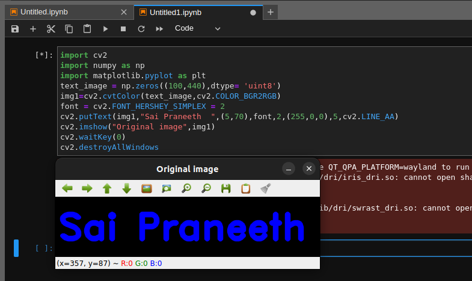
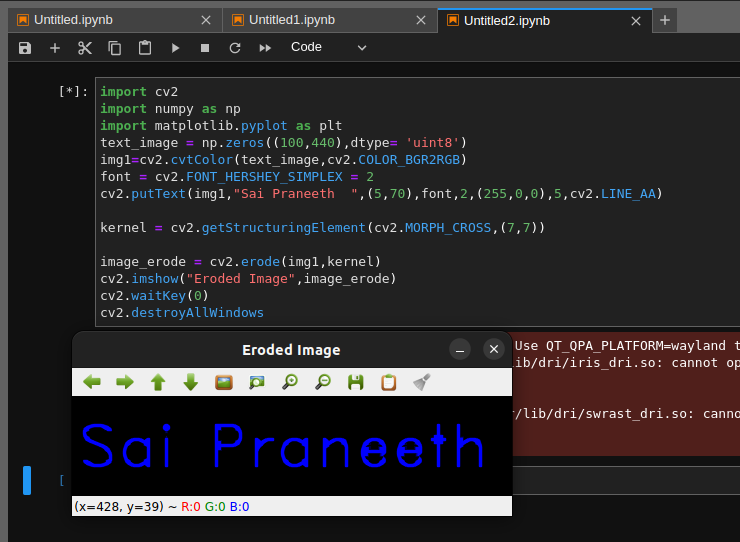
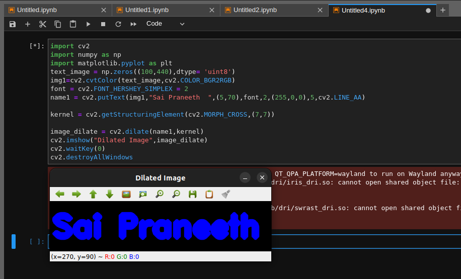

# Implementation-of-Erosion-and-Dilation
## Aim
To implement Erosion and Dilation using Python and OpenCV.
## Software Required
1. Anaconda - Python 3.7
2. OpenCV
## Algorithm:
### Step1:
Import the necessary packages.
### Step2:
Create the Text using cv2.putText.
### Step3:
Create the structuring element.
### Step4:
Erode and Dilate the image.
### Step5:
 End Program.
## Program:
# Import the necessary packages
``` Python
import cv2
import numpy as np
import matplotlib.pyplot as plt
```
### Create the Text using cv2.putText
```python
text_image = np.zeros((100,440),dtype= 'uint8')
img1=cv2.cvtColor(text_image,cv2.COLOR_BGR2RGB)
font = cv2.FONT_HERSHEY_SIMPLEX = 2
cv2.putText(img1,"Sai Praneeth  ",(5,70),font,2,(255,0,0),5,cv2.LINE_AA)
cv2.imshow("Original image",img1)
cv2.waitKey(0)
cv2.destroyAllWindows
```
### Create the structuring element
```python
kernel = cv2.getStructuringElement(cv2.MORPH_CROSS,(7,7))
```
### Erode the image
```python
image_erode = cv2.erode(name1,kernel)
cv2.imshow("Eroded Image",image_erode)
cv2.waitKey(0)
cv2.destroyAllWindows
```
### Dilate the image
```python
name1 = cv2.putText(img1,"Sai Praneeth  ",(5,70),font,2,(255,0,0),5,cv2.LINE_AA)
image_dilate = cv2.dilate(name1,kernel)
cv2.imshow("Dilated Image",image_dilate)
cv2.waitKey(0)
cv2.destroyAllWindows
```
## Output:

### Display the input Image

### Display the Eroded Image

### Display the Dilated Image

## Result
Thus the generated text image is eroded and dilated using python and OpenCV.